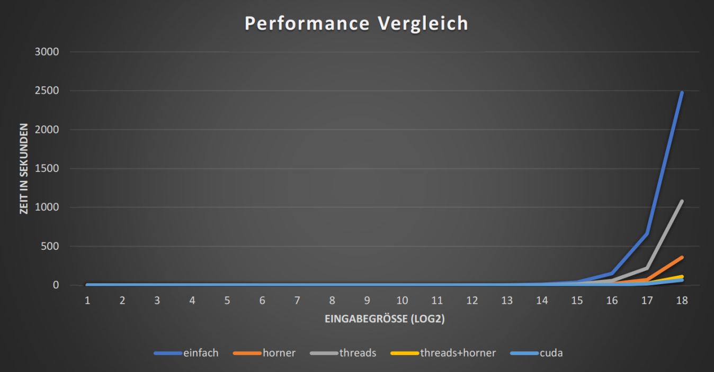

# Libraries

Man brauch nur CUDA und das CUDA-Toolkit, zusammen mit der Julia Standardbilbiothek um dies auszuführen.
Könnte etwas länger dauern, vor allem bei hörerem `max_exp`, welche die Datengröße bestimmmt.

